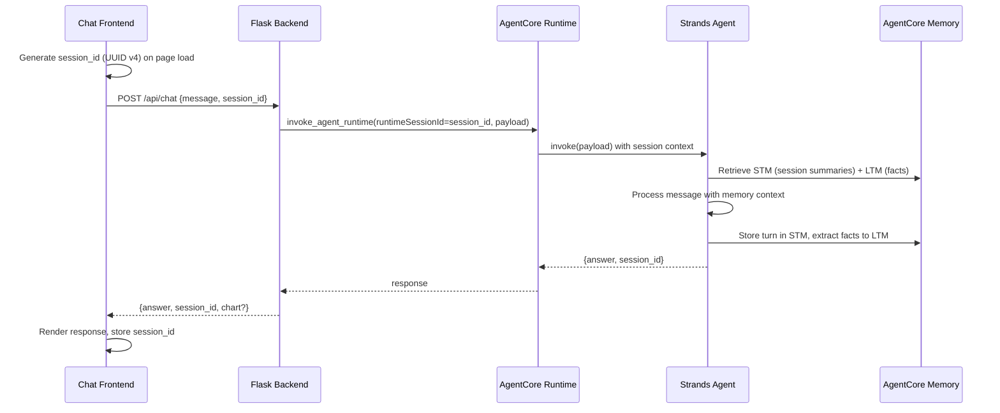

# Design Document: AgentCore Memory Multi-Turn

## Overview

This design adds multi-turn conversation memory to the Expense Tracker chat agent. The core change is integrating AgentCore Memory (short-term + long-term) into the Strands Agent, propagating a persistent session ID from the frontend through Flask to the AgentCore Runtime, and updating the chat UI to manage session lifecycle.

**Key architectural decision:** The Strands Agent must be created per-request rather than as a module-level singleton. The `AgentCoreMemorySessionManager` is tied to a specific `session_id` and is passed to the `Agent` constructor via `session_manager=`. Since sessions differ per request, the Agent instance must be constructed fresh each invocation.

**Research findings:**
- The Strands `Agent` accepts a `session_manager` parameter at construction time — there is no way to swap it after creation.
- `AgentCoreMemorySessionManager` should be used as a context manager (`with ... as session_manager`) to ensure buffered messages are flushed.
- Only one agent per session is supported at a time.
- Namespaces must start and end with `/` (e.g., `/summaries/{actorId}/{sessionId}/`).

## Architecture



### Session ID Flow

1. **Frontend** generates a UUID v4 on page load, stores it in a module-level variable
2. **Frontend** includes `session_id` in every `POST /api/chat` request body
3. **Flask** extracts `session_id` from the request (or generates one if missing)
4. **Flask** passes it as `runtimeSessionId` to `invoke_agent_runtime()`
5. **Agent** receives the session_id in the payload and creates a per-request `AgentCoreMemorySessionManager`
6. **Agent** creates a new `Agent` instance with that session_manager for each invocation
7. **Flask** returns the `session_id` in the response for frontend confirmation

### Memory Architecture

| Memory Type | Strategy | Namespace | Scope |
|---|---|---|---|
| Short-term (STM) | `summaryMemoryStrategy` | `/summaries/{actorId}/{sessionId}/` | Per-session conversation context |
| Long-term (LTM) | `semanticMemoryStrategy` | `/facts/{actorId}/` | Cross-session user facts |

## Components and Interfaces

### 1. Frontend (`chat.js`)

**New state:**
```javascript
let sessionId = crypto.randomUUID(); // generated on page load
```

**Modified `sendMessage()`:**
```javascript
body: JSON.stringify({ message: text, session_id: sessionId })
```

**New "New Conversation" button:**
- Placed in `.chat-card-header`
- On click: `sessionId = crypto.randomUUID()`, clear messages DOM, re-show welcome message

**Scroll behavior:**
- Track whether user has scrolled up (via `scroll` event listener)
- Only auto-scroll if user is near the bottom

### 2. Flask Backend (`backend/app.py`)

**Modified `/api/chat` endpoint:**
```python
@app.route("/api/chat", methods=["POST"])
def chat():
    data = request.get_json()
    message = (data.get("message") or "").strip()
    session_id = data.get("session_id") or str(uuid.uuid4())
    
    # ... validation ...
    
    response = agentcore_client.invoke_agent_runtime(
        agentRuntimeArn=runtime_arn,
        runtimeSessionId=session_id,
        payload=json.dumps({
            "prompt": message,
            "session_id": session_id,
        }).encode(),
    )
    
    # Include session_id in response
    return jsonify({
        "answer": answer,
        "session_id": session_id,
        "chart": chart,
    })
```

### 3. Agent (`agent/agent.py`)

**Per-request Agent creation pattern:**
```python
from memory import get_session_manager

MEMORY_ENABLED = bool(os.environ.get("AGENTCORE_MEMORY_ID"))

@app.entrypoint
def invoke(payload):
    user_message = payload.get("prompt", payload.get("message", "Hello"))
    session_id = payload.get("session_id", "ephemeral")
    
    if MEMORY_ENABLED:
        with get_session_manager(session_id) as session_manager:
            agent = Agent(
                model=model,
                system_prompt=system_prompt,
                tools=[query_expenses, get_summary, chart_builder],
                session_manager=session_manager,
                callback_handler=None,
            )
            result = agent(user_message)
    else:
        logger.warning("AGENTCORE_MEMORY_ID not set — running without memory")
        result = agent_no_memory(user_message)
    
    return {"answer": str(result), "session_id": session_id}
```

The `model`, `system_prompt`, and `tools` are still created at module level (they're stateless and reusable). Only the `Agent` instance is per-request because it binds to a session_manager.

### 4. Memory Module (`agent/memory.py`)

**Changes:**
- `get_session_manager()` already returns an `AgentCoreMemorySessionManager` — no functional change needed
- Ensure it supports context manager protocol (it already does per the SDK docs)
- Fix namespace format to include trailing slash: `/summaries/{actorId}/{sessionId}/` and `/facts/{actorId}/`
- Graceful degradation: if `AGENTCORE_MEMORY_ID` is empty, return `None` instead of raising

### 5. Deploy Script (`infra/deploy_agentcore.py`)

**Already supports `--create-memory`** — the existing `create_memory()` function provisions the resource and saves the ID to `.agentcore-state.json`. No changes needed to the deploy script itself; it already fulfills Requirement 1.

## Data Models

### Request: `POST /api/chat`

```json
{
  "message": "string (required, 1-1000 chars)",
  "session_id": "string (optional, UUID v4)"
}
```

### Response: `POST /api/chat`

```json
{
  "answer": "string",
  "session_id": "string (UUID v4 used for this request)",
  "sql": null,
  "data": null,
  "chart": null | { /* Chart.js config */ }
}
```

### Agent Payload (Flask → AgentCore Runtime)

```json
{
  "prompt": "string",
  "session_id": "string (UUID v4)"
}
```

### Agent Response (AgentCore Runtime → Flask)

```json
{
  "answer": "string",
  "session_id": "string",
  "chart": null | { /* Chart.js config */ }
}
```

### AgentCoreMemoryConfig (internal)

| Field | Value |
|---|---|
| `memory_id` | From `AGENTCORE_MEMORY_ID` env var |
| `session_id` | From request payload |
| `actor_id` | `"default_user"` (no auth in this app) |
| `retrieval_config` | See below |

**Retrieval config:**
```python
{
    "/facts/{actorId}/": RetrievalConfig(top_k=10, relevance_score=0.5),
    "/summaries/{actorId}/{sessionId}/": RetrievalConfig(top_k=5, relevance_score=0.5),
}
```

## Correctness Properties

*A property is a characteristic or behavior that should hold true across all valid executions of a system — essentially, a formal statement about what the system should do. Properties serve as the bridge between human-readable specifications and machine-verifiable correctness guarantees.*

### Property 1: Session ID passthrough invariant

*For any* valid session_id string provided in a `POST /api/chat` request body, the Flask backend SHALL pass that exact value as `runtimeSessionId` to the AgentCore Runtime invocation, unchanged.

**Validates: Requirements 3.3, 4.1**

### Property 2: Response always contains session_id

*For any* `POST /api/chat` request (whether or not it includes a `session_id` field), the response body SHALL contain a `session_id` field with a valid UUID v4 string.

**Validates: Requirements 4.3**

### Property 3: Session manager configured with request session_id

*For any* valid session_id received in the agent payload, the `AgentCoreMemorySessionManager` created for that request SHALL have its config `session_id` equal to the received session_id.

**Validates: Requirements 2.1**

### Property 4: New conversation produces a distinct session_id

*For any* current session_id value, clicking "New Conversation" SHALL produce a new session_id that is different from the previous one and is a valid UUID v4.

**Validates: Requirements 5.2**

### Property 5: Messages rendered in chronological send order

*For any* sequence of N messages sent within a single session, the chat message DOM elements SHALL appear in the same chronological order as they were sent (user and assistant messages interleaved in request/response order).

**Validates: Requirements 6.1**


## Error Handling

### Agent Memory Unavailable

| Condition | Behavior |
|---|---|
| `AGENTCORE_MEMORY_ID` not set | Agent operates without memory, logs a warning, responds normally without context |
| Memory service timeout/error | Agent catches exception, falls back to stateless response, logs error |
| Invalid session_id format | Accept any non-empty string — AgentCore Memory handles validation |

### Flask Backend

| Condition | Behavior |
|---|---|
| Missing `session_id` in request | Generate a UUID v4, proceed normally |
| AgentCore Runtime unavailable | Return 502 with `{"error": "Agent service unavailable"}` |
| AgentCore invocation error | Return 502 with `{"error": "Agent returned an error"}` |
| Empty/missing message | Return 400 with `{"error": "Message is required"}` (unchanged) |

### Frontend

| Condition | Behavior |
|---|---|
| `crypto.randomUUID()` unavailable | Fallback to a timestamp-based pseudo-UUID (extremely unlikely in modern browsers) |
| Response missing `session_id` | Keep using the locally-generated session_id (don't overwrite) |
| Network error during chat | Show error bubble, keep session_id intact for retry |

### Graceful Degradation Strategy

The system degrades gracefully at each layer:
1. **No memory env var** → Agent works statelessly (single-turn mode)
2. **Memory service error** → Agent catches, responds without context, logs error
3. **No session_id from frontend** → Flask generates one (backward compatibility)
4. **Response format change** → Frontend uses local session_id if response field is missing

## Testing Strategy

### Unit Tests (Example-Based)

| Test | Component | Validates |
|---|---|---|
| Deploy script persists memory_id to state file | `deploy_agentcore.py` | Req 1.2 |
| Deploy script prints export command | `deploy_agentcore.py` | Req 1.3 |
| Agent falls back gracefully without memory env var | `agent.py` | Req 2.5 |
| Flask generates UUID when session_id missing | `app.py` | Req 3.4, 4.2 |
| Frontend generates valid UUID on page load | `chat.js` | Req 3.1 |
| New Conversation button exists in DOM | `chat.html` | Req 5.1 |
| New Conversation clears messages | `chat.js` | Req 5.3 |
| New Conversation shows welcome message | `chat.js` | Req 5.4 |
| Page refresh starts new session | `chat.js` | Req 6.2 |
| Scroll position preserved on scroll-up | `chat.js` | Req 6.3 |

### Property-Based Tests

**Library:** [Hypothesis](https://hypothesis.readthedocs.io/) (Python), minimum 100 iterations per property.

| Property | Component | Tag |
|---|---|---|
| Property 1: Session ID passthrough | Flask `/api/chat` | `Feature: agentcore-memory-multiturn, Property 1: Session ID passthrough invariant` |
| Property 2: Response contains session_id | Flask `/api/chat` | `Feature: agentcore-memory-multiturn, Property 2: Response always contains session_id` |
| Property 3: Session manager config matches | `agent/agent.py` | `Feature: agentcore-memory-multiturn, Property 3: Session manager configured with request session_id` |

Properties 4 and 5 are frontend-side (JavaScript). They can be tested with [fast-check](https://fast-check.dev/) if a JS test framework is added, or validated manually. For now, focus PBT on the Python backend where Hypothesis is already available.

### Integration Tests

| Test | Validates |
|---|---|
| Multi-turn conversation: follow-up question uses STM context | Req 7.1, 7.2 |
| New session has no STM context from previous session | Req 7.3 |
| LTM facts persist across sessions | Req 8.1, 8.2 |
| LTM fact correction updates stored fact | Req 8.3 |
| Memory retrieval and storage called during agent invocation | Req 2.2, 2.3, 2.4 |
| Deploy script creates memory resource via AWS API | Req 1.1 |

### Test Configuration

- Property tests: `@settings(max_examples=100)` via Hypothesis
- Unit tests: pytest with mocked AWS clients (boto3 stubber or unittest.mock)
- Integration tests: require `AGENTCORE_MEMORY_ID` env var set; skip if not available
- Frontend tests: manual or future Playwright/fast-check integration
