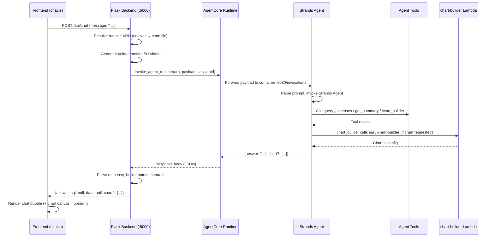
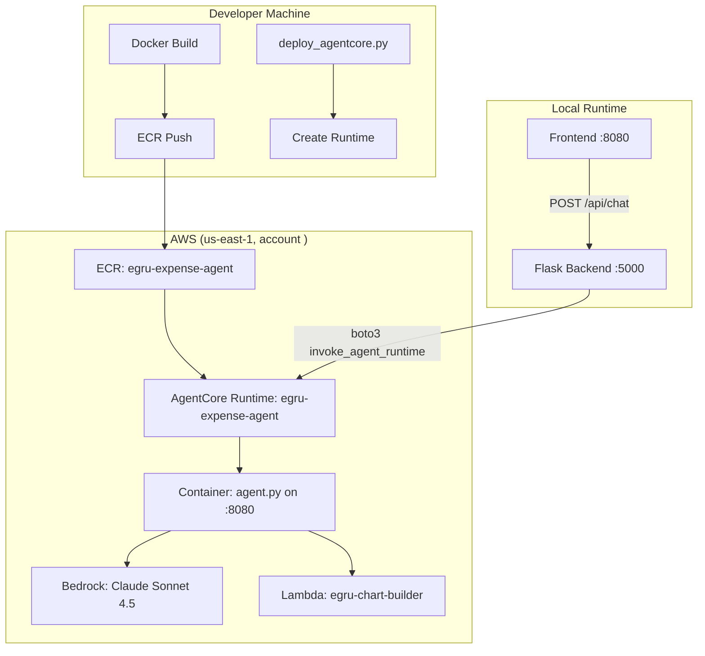
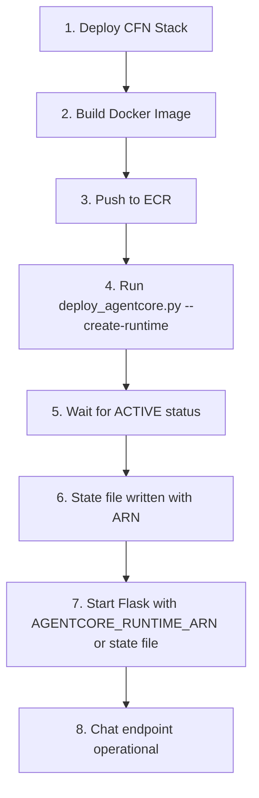

# Design Document: AgentCore Runtime Deployment

## Overview

This design covers deploying the Strands Agent to Amazon Bedrock AgentCore Runtime and wiring the Flask `/api/chat` endpoint to proxy requests to the deployed agent. The system follows a straightforward request-proxy pattern: the frontend sends chat messages to Flask, Flask invokes the AgentCore Runtime via boto3, and returns the agent's response.

The key components are:
1. **Agent Container** — Docker image (linux/arm64) running the Strands Agent on port 8080
2. **AgentCore Runtime** — AWS-managed serverless compute hosting the container
3. **Flask Chat Proxy** — The `/api/chat` endpoint that bridges frontend requests to the runtime
4. **Deploy Script** — boto3-based script that creates the runtime and persists state

This is Phase 1 of the AgentCore migration — stateless, single-turn chat with feature parity to v1.

## Architecture



### Deployment Architecture



## Components and Interfaces

### 1. Flask Chat Proxy (`backend/app.py`)

The `/api/chat` endpoint is the bridge between the frontend and AgentCore Runtime.

**Interface:**
```python
# Request
POST /api/chat
Content-Type: application/json
{"message": "How much did I spend on hotels?"}

# Response (success)
200 OK
{
    "answer": "You spent $1,200 on hotels across 3 expense reports.",
    "sql": null,
    "data": null,
    "chart": null  # or Chart.js config object
}

# Response (agent unavailable)
502 Bad Gateway
{"error": "Agent service unavailable"}

# Response (not configured)
503 Service Unavailable
{"error": "Agent runtime not configured"}
```

**Implementation details:**

```python
import json
import uuid
import logging
import boto3
from botocore.config import Config as BotoConfig
from botocore.exceptions import ClientError, ReadTimeoutError, ConnectTimeoutError

# Configuration resolution
AGENTCORE_RUNTIME_ARN = os.environ.get("AGENTCORE_RUNTIME_ARN")
STATE_FILE_PATH = os.path.join(
    os.path.dirname(__file__), "..", "infra", ".agentcore-state.json"
)

def get_runtime_arn():
    """Resolve the agent runtime ARN from env var or state file."""
    if AGENTCORE_RUNTIME_ARN:
        return AGENTCORE_RUNTIME_ARN
    try:
        with open(STATE_FILE_PATH) as f:
            state = json.load(f)
            return state.get("agent_runtime_arn")
    except (FileNotFoundError, json.JSONDecodeError):
        return None

# boto3 client with timeout configuration
boto_config = BotoConfig(
    region_name=BEDROCK_REGION,
    read_timeout=90,       # Agent may take time to process
    connect_timeout=10,
    retries={"max_attempts": 1}  # Don't retry agent calls
)
agentcore_client = boto3.client("bedrock-agentcore", config=boto_config)
```

**Key design decisions:**
- **Stateless sessions**: Each request gets a unique `runtimeSessionId` (UUID4). Multi-turn memory is deferred to Phase 2.
- **No retry on agent calls**: Agent invocations are not idempotent (they may trigger tool calls with side effects in future phases). Single attempt with generous timeout.
- **Lazy ARN resolution**: The ARN is resolved on each request (not cached at startup) so the backend can pick up a newly deployed runtime without restart.

### 2. Agent Container (`agent/agent.py`)

The agent is already implemented using `BedrockAgentCoreApp` from the `bedrock-agentcore` package. It:
- Listens on port 8080 at `/invocations` (AgentCore Runtime convention)
- Accepts `{"prompt": "..."}` payloads
- Returns `{"answer": "..."}` with optional `chart` field when `chart_builder` tool is used
- Uses Claude Sonnet 4.5 via Bedrock for reasoning
- Has 3 tools: `query_expenses`, `get_summary`, `chart_builder`

No changes needed to the agent code for this feature.

### 3. Deploy Script (`infra/deploy_agentcore.py`)

Already implemented. Creates the AgentCore Runtime resource via `boto3.client("bedrock-agentcore-control")` and persists state to `.agentcore-state.json`.

**State file format:**
```json
{
  "agent_runtime_arn": "arn:aws:bedrock-agentcore:us-east-1:<AWS_ACCOUNT_ID>:runtime/egru-expense-agent/...",
  "agent_runtime_endpoint": "https://..."
}
```

### 4. Docker Image (`infra/Dockerfile`)

Already implemented. Builds a linux/arm64 image with:
- Python 3.12 slim base
- Agent code + dependencies
- `expenses.db` baked in at `/data/expenses.db` (Phase 1 approach)
- Exposes port 8080

## Data Models

### Request/Response Flow

```
Frontend → Flask:
  POST /api/chat
  Body: {"message": string}

Flask → AgentCore Runtime (boto3):
  invoke_agent_runtime(
    agentRuntimeArn: string,
    runtimeSessionId: string (UUID4),
    payload: bytes (JSON: {"prompt": string})
  )

AgentCore Runtime → Agent Container:
  POST /invocations
  Body: {"prompt": string}

Agent Container → AgentCore Runtime:
  Response: {"answer": string, "chart"?: object}

AgentCore Runtime → Flask (boto3 response):
  response["body"]: StreamingBody (JSON bytes)

Flask → Frontend:
  Response: {
    "answer": string,
    "sql": null,
    "data": null,
    "chart": object | null
  }
```

### Configuration State

| Variable | Source | Default | Purpose |
|----------|--------|---------|---------|
| `AGENTCORE_RUNTIME_ARN` | Env var | None | Agent runtime ARN for invocation |
| `BEDROCK_REGION` | Env var | `us-east-1` | AWS region for boto3 clients |
| State file ARN | `infra/.agentcore-state.json` | None | Fallback ARN source |

## Correctness Properties

*A property is a characteristic or behavior that should hold true across all valid executions of a system — essentially, a formal statement about what the system should do. Properties serve as the bridge between human-readable specifications and machine-verifiable correctness guarantees.*

### Property 1: Message forwarding preserves content

*For any* valid message string (non-empty, ≤1000 characters), when the Chat Proxy invokes the AgentCore Runtime, the payload SHALL contain that exact message as the `prompt` field with no modification.

**Validates: Requirements 3.1**

### Property 2: Response contract compliance

*For any* valid agent response (containing an `answer` field and optionally a `chart` field), the Chat Proxy response SHALL always contain exactly the fields `answer` (string), `sql` (null), `data` (null), and `chart` (object or null), preserving the answer text and chart config unchanged.

**Validates: Requirements 3.2, 3.3, 5.3**

### Property 3: Session ID uniqueness

*For any* sequence of N chat invocations, all generated `runtimeSessionId` values SHALL be unique (no two invocations share the same session ID).

**Validates: Requirements 3.7**

### Property 4: State file persistence round-trip

*For any* valid agent runtime ARN and endpoint URL returned by the AgentCore control plane, after the deploy script completes, reading the state file SHALL yield the same ARN and endpoint values that were returned.

**Validates: Requirements 2.2**

## Error Handling

### Error Categories and Responses

| Scenario | HTTP Status | Response Body | Trigger |
|----------|-------------|---------------|---------|
| Empty/missing message | 400 | `{"error": "Message is required"}` | Client sends empty body |
| Message too long | 400 | `{"error": "Message must be 1000 characters or fewer"}` | Message > 1000 chars |
| Runtime not configured | 503 | `{"error": "Agent runtime not configured"}` | No ARN in env or state file |
| Network/timeout error | 502 | `{"error": "Agent service unavailable"}` | boto3 connection/read timeout |
| Agent error response | 502 | `{"error": "Agent returned an error"}` | Agent returns error in body |
| Unexpected exception | 500 | `{"error": "Internal server error"}` | Unhandled exception |

### Error Handling Strategy

```python
@app.route("/api/chat", methods=["POST"])
def chat():
    # 1. Validate input
    data = request.get_json()
    message = (data.get("message") or "").strip()
    if not message:
        return jsonify({"error": "Message is required"}), 400
    if len(message) > 1000:
        return jsonify({"error": "Message must be 1000 characters or fewer"}), 400

    # 2. Resolve runtime ARN
    runtime_arn = get_runtime_arn()
    if not runtime_arn:
        return jsonify({"error": "Agent runtime not configured"}), 503

    # 3. Invoke agent
    try:
        session_id = str(uuid.uuid4())
        response = agentcore_client.invoke_agent_runtime(
            agentRuntimeArn=runtime_arn,
            runtimeSessionId=session_id,
            payload=json.dumps({"prompt": message}).encode(),
        )
        # 4. Parse response
        body = json.loads(response["body"].read())
        answer = body.get("answer", "")
        chart = body.get("chart")

        return jsonify({
            "answer": answer,
            "sql": None,
            "data": None,
            "chart": chart,
        })

    except (ReadTimeoutError, ConnectTimeoutError, ConnectionError):
        return jsonify({"error": "Agent service unavailable"}), 502
    except ClientError as e:
        logging.error(f"AgentCore invocation error: {e}")
        return jsonify({"error": "Agent returned an error"}), 502
    except Exception as e:
        logging.error(f"Unexpected chat error: {e}")
        return jsonify({"error": "Internal server error"}), 500
```

### Startup Validation

At Flask startup, the backend logs a warning if no runtime ARN is available:

```python
runtime_arn = get_runtime_arn()
if not runtime_arn:
    logging.warning(
        "AGENTCORE_RUNTIME_ARN not set and state file not found. "
        "Chat endpoint will return 503 until configured."
    )
```

This is a warning, not a fatal error — the CRUD endpoints still work without the agent.

## Testing Strategy

### Unit Tests (pytest)

Unit tests cover the Flask Chat Proxy logic with mocked boto3 calls:

- **Input validation**: empty message, oversized message, missing body
- **ARN resolution**: env var present, state file fallback, neither available
- **Success path**: agent returns answer only, agent returns answer + chart
- **Error paths**: timeout, connection error, ClientError, malformed response
- **Session ID**: verify UUID4 format

### Property-Based Tests (Hypothesis)

Property-based tests verify universal properties across generated inputs:

- **Property 1**: Generate random valid messages (1–1000 chars), verify payload forwarding
- **Property 2**: Generate random agent responses (various answer strings, optional chart configs), verify response contract
- **Property 3**: Generate batches of invocations, verify all session IDs are unique
- **Property 4**: Generate random ARN/endpoint pairs, verify state file round-trip

**Configuration:**
- Library: Hypothesis (Python)
- Minimum iterations: 100 per property
- Tag format: `Feature: agentcore-runtime-deployment, Property N: <description>`

### Integration Tests

Integration tests run against the deployed agent (require AWS credentials):

- Send a summary prompt → verify text answer with total
- Send a category query → verify filtered results
- Send a chart request → verify Chart.js config in response
- Send an unclear prompt → verify helpful fallback response

### Smoke Tests

- Docker build produces arm64 image with correct tag
- Deploy script exits with error when env vars are missing
- Flask starts without agent configured (CRUD still works)
- boto3 client timeout is ≥ 60 seconds

## Deployment Flow

### Build and Deploy Sequence



### Commands

```bash
# Step 1: CFN stack (prerequisite — already deployed)
aws cloudformation deploy --template-file infra/template.yaml \
  --stack-name egru-expense-agent-stack \
  --capabilities CAPABILITY_NAMED_IAM --region us-east-1 --tags user=egru

# Step 2-3: Build and push
aws ecr get-login-password --region us-east-1 | \
  docker login --username AWS --password-stdin <AWS_ACCOUNT_ID>.dkr.ecr.us-east-1.amazonaws.com

docker build --platform linux/arm64 -f infra/Dockerfile -t egru-expense-agent .
docker tag egru-expense-agent:latest \
  <AWS_ACCOUNT_ID>.dkr.ecr.us-east-1.amazonaws.com/egru-expense-agent:latest
docker push <AWS_ACCOUNT_ID>.dkr.ecr.us-east-1.amazonaws.com/egru-expense-agent:latest

# Step 4-6: Deploy runtime
export ECR_IMAGE_URI=<AWS_ACCOUNT_ID>.dkr.ecr.us-east-1.amazonaws.com/egru-expense-agent:latest
export AGENT_RUNTIME_ROLE=arn:aws:iam::<AWS_ACCOUNT_ID>:role/egru-expense-agent-runtime-role
python infra/deploy_agentcore.py --create-runtime

# Step 7: Start Flask (option A: env var)
export AGENTCORE_RUNTIME_ARN=$(python -c "import json; print(json.load(open('infra/.agentcore-state.json'))['agent_runtime_arn'])")
python backend/app.py

# Step 7: Start Flask (option B: state file auto-detection)
python backend/app.py  # reads from infra/.agentcore-state.json automatically
```

### Docker Image Contents

```
/app/
├── agent.py              # Entrypoint (CMD python agent.py)
├── memory.py
├── requirements.txt
├── prompts/
│   └── system.txt
└── tools/
    ├── __init__.py
    ├── query_expenses.py
    ├── get_summary.py
    └── chart_builder.py

/data/
└── expenses.db           # Baked-in database (Phase 1)
```

The container responds to:
- `GET /ping` — health check (returns 200)
- `POST /invocations` — agent invocation endpoint
